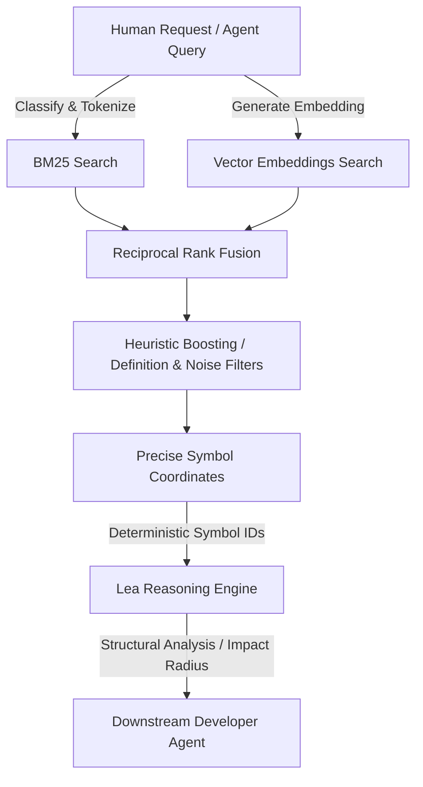

<div align="center">


# Lynx

### Symbol-first repository discovery engine for AI-native developer tooling.

**Lynx transforms developer intent into stable repository coordinates — symbols, files, and structural chunks — enabling downstream reasoning systems like Lea to operate on deterministic code primitives instead of fragile text spans.**

[](https://crates.io/crates/pizen-lynx)
[](https://docs.rs/pizen-lynx)
[](https://github.com/PizenLabs/lynx/actions)
[](./LICENSE)
[](https://github.com/PizenLabs/lynx/stargazers)

---

 **Lynx discovers. Lea reasons.**

[Features](#features) •
[Ecosystem & Architecture](#ecosystem--architecture) •
[Design Principles](#design-principles) •
[Installation](#installation) •
[CLI Usage](#cli-usage) •
[MCP Server](#mcp-server) •
[Repository Layout](#repository-layout) •
[Contributing](#contributing)

</div>

## Features

- **Symbol-first discovery** with stable, deterministic identifiers rather than fragile text snippets.
- **Multilingual Support**: Tree-sitter parsing for structured symbol extraction and syntax-aware chunking:
  - **Rust** (`.rs`)
  - **Go** (`.go`)
  - **TypeScript / TSX** (`.ts`, `.tsx`)
  - **JavaScript / JSX** (`.js`, `.jsx`)
  - **Python** (`.py`)
- **Hybrid Retrieval**: Integrates **BM25 lexical search** (via Tantivy) with **semantic vector search** (via FastEmbed utilizing `bge-small-en-v1.5`) using **Reciprocal Rank Fusion (RRF)** for optimal relevance.
- **Local-first, CPU-first**: Zero cloud or GPU dependencies. Operates entirely offline with high-performance local indexing.
- **Heuristic Signal Boosting**:
  - *Definition Boost*: Prioritizes symbol definitions over code references (1.5x score multiplier).
  - *Noise Suppression*: Filters and penalizes mock, test, generated, and vendor code automatically.
- **Integrations**: Supports a minimal stdio **Model Context Protocol (MCP) server** and integrates natively with the **Lea** reasoning layer.

---

## Ecosystem & Architecture

Lynx sits at the absolute beginning of the AI-native developer pipeline. It converts human queries or vague agent intents into exact coordinates in a repository, passing them off to reasoning engines like Lea for structural analysis.



---

## Design Principles

1. **Discovery Only**: Lynx does not perform reasoning, dependency analyses, or calculate impact radius. Its sole job is to answer: *"Where is this concept located?"*
2. **Speed First**: Cold queries execute in `< 100ms`, while cached or warm queries resolve in `< 10ms`.
3. **Token Efficiency**: Instead of dumping thousands of raw lines or dozens of files, Lynx provides the minimal, precise coordinates (symbol ranges, file coordinates) needed.
4. **Deterministic Base**: Bypasses ranking completely for exact symbol lookups (`O(1)` complexity) to guarantee repeatability.

---

## Installation

Install the CLI directly from crates.io:

```bash
cargo install pizen-lynx
```

The CLI installs under the binary name **`lx`**.

---

## CLI Usage


### 1. Indexing a Repository
Build the persistent `.lynx` index for a repository:
```bash
lx index /path/to/repo
```
*Test, mock, and generated files are skipped by default. Include them with `--include-tests`; rebuild an existing `.lynx` with `--force`:*
```bash
lx index /path/to/repo --include-tests --force
```

### 2. Conceptual Search
Fused lexical + semantic retrieval over the workspace, printing ranked evidence:
```bash
lx search "jwt validation token"
lx search "jwt validation token" --mode semantic --limit 5
```

### 3. Symbol Resolution
Resolve an exact symbol's identity coordinates bypassing rank fusion:
```bash
lx resolve Login
```

### 4. Structural Relations
Print the relation graph incident to a symbol (calls, contains, implements, ...):
```bash
lx relations Validate
```

### 5. Compiled Context Package
Emit a token-budgeted `ContextPackage` as JSON:
```bash
lx context "user validation handler" --token-budget 2048
```

Retrieval subcommands operate on a session index of the current workspace (git toplevel of the working directory); only `lx index` writes the `.lynx` artifact.

---

## MCP Server

Lynx includes a built-in **Model Context Protocol (MCP)** server communicating over standard input/output (stdio). This allows LLMs and AI agents (like Claude Desktop) to query symbols and relations natively.

### Running the Server
You can launch the server directly from the CLI:
```bash
lx mcp
```
Or run the standalone binary directly (optional argument: workspace root):
```bash
cargo run -p pizen-lynx-mcp -- /path/to/repo
```
The server indexes its workspace at startup and speaks newline-delimited JSON-RPC 2.0 (`initialize`, `tools/list`, `tools/call`, `ping`).

### Supported MCP Tools

| Tool | Arguments | Primitive |
|------|-----------|-----------|
| `search` | `query`, `mode?`, `limit?` | Hybrid RRF search returning ranked Evidence |
| `resolve` | `name` | Exact symbol lookup by fqdn or trailing name |
| `inspect` | `symbol_hash` | Full evidence for a content hash |
| `relations` | `symbol_hash`, `kind?` | Structural edges incident to a symbol |
| `similar` | `symbol_hash` | Embedding-similarity neighbors |
| `context` | `query`, `token_budget?` | Compiled, budget-bounded ContextPackage |
| `index_status` | `path?` | Provenance and population counts of the served index |

Example `tools/call` frame:
```json
{"jsonrpc":"2.0","id":1,"method":"tools/call","params":{"name":"search","arguments":{"query":"authentication flow"}}}
```

---

## Repository Layout

```
crates/
  lynx-cli/       # CLI tool and subcommand handler (crate: pizen-lynx)
  lynx-common/    # Shared utilities and core workspace structures (crate: pizen-lynx-common)
  lynx-core/      # RRF pipeline, classification, indexing, and ranking (crate: pizen-lynx-core)
  lynx-embed/     # Embedding abstraction and local FastEmbed provider (crate: pizen-lynx-embed)
  lynx-mcp/       # Standalone MCP server over stdio (crate: pizen-lynx-mcp)
  lynx-parser/    # Syntax parsing and Tree-sitter symbol extraction (crate: pizen-lynx-parser)
  lynx-protocol/  # Shared serializable serialization protocols (crate: pizen-lynx-protocol)
  lynx-storage/   # Tantivy lexical indexing & embedding persistence (crate: pizen-lynx-storage)
```

---

## Contributing

We welcome issues and pull requests! Ensure all formatters, lints, and tests pass successfully before submitting changes:

```bash
make ci
```

---

## License

MIT

